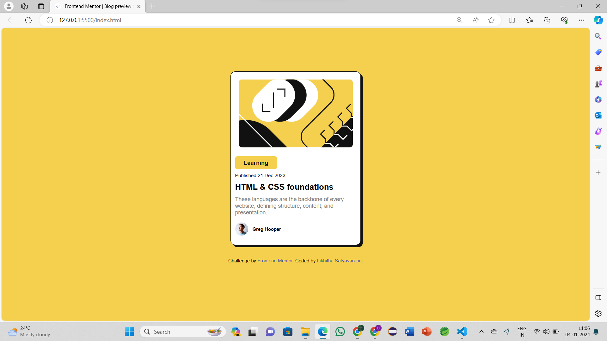
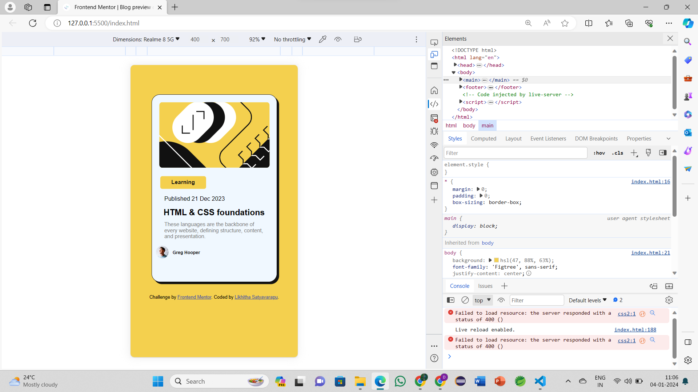

# Frontend Mentor - Blog preview card

## Welcome! 👋

Thanks for checking out this front-end coding challenge.

[Frontend Mentor](https://www.frontendmentor.io) challenges help you improve your coding skills by building realistic projects.

**To do this challenge, you need a basic understanding of HTML and CSS.**

# Frontend Mentor - Blog preview card solution

This is a solution to the [Blog preview card challenge on Frontend Mentor](https://www.frontendmentor.io/challenges/blog-preview-card-ckPaj01IcS). Frontend Mentor challenges help you improve your coding skills by building realistic projects. 

## Table of contents

- [Overview](#overview)
  - [The challenge](#the-challenge)
  - [Screenshot](#screenshot)
  - [Links](#links)
- [My process](#my-process)
  - [Built with](#built-with)
  - [What I learned](#what-i-learned)
  - [Continued development](#continued-development)
  - [Useful resources](#useful-resources)
- [Author](#author)
- [Acknowledgments](#acknowledgments)

## Overview

### The challenge

The challenge from Frontend Mentor was to create a responsive blog preview card with specific emphasis on hover and focus states for interactive elements. The primary goal was to showcase the ability to design and implement a visually appealing and interactive component.

### Screenshot

### Links

- Solution URL: [Add solution URL here](https://your-solution-url.com)
- Live Site URL: [Add live site URL here](https://your-live-site-url.com)

## My process

### Built with

The project utilized the following technologies and methodologies:

- **Semantic HTML5:** Structuring the document for accessibility and clarity.
- **CSS3:** Styling the components with a mobile-first approach and incorporating hover/focus states.
- **Responsive Design:** Utilizing media queries to ensure a seamless experience across different devices.
- **Flexbox:** Employed for flexible and responsive layout design.
- **Mobile-First Workflow:** Ensuring a solid foundation for smaller screens before enhancing for larger devices.

### What I learned

Throughout the development of the Blog Preview Card project, I enhanced my skills:

- **Interactive States:** Explored and implemented hover and focus states to enhance user interaction with the Blog Preview Card.
- **Mobile-First Approach:** Embraced the mobile-first design philosophy, starting with a layout optimized for smaller screens and progressively enhancing    for larger devices.
- **Responsive Design Techniques:** Utilized media queries to create a fluid and adaptive layout that ensures a seamless experience across various screen sizes.
- **Flexbox Mastery:** Gained a deeper understanding of Flexbox, leveraging it for efficient and responsive component positioning.
- **Responsive Images:** Explored techniques for optimizing and displaying images responsively based on the device's screen size.
- **User-Centric Design:** Focused on user experience by incorporating interactive elements, making the Blog Preview Card more engaging and visually appealing.

### Continued development

Areas for future development include:

- **Advanced CSS Techniques:** Exploring more advanced styling features and animations.
- **Cross-Browser Compatibility:** Ensuring consistent performance across various browsers.
- **User Accessibility:** Focusing on accessibility improvements for a broader user base.
- **Box Shadow Techniques:** For continued development, I aim to explore more advanced box shadow techniques, experimenting with different shadow properties and layering effects to add depth and dimension to the Blog Preview Card.

### Useful resources

Resources that proved beneficial in completing this challenge:
-[Frontend Mentor](https://www.frontendmentor.io?ref=challenge): The challenges on Frontend Mentor served as an engaging platform, allowing me to refine my front-end development skills through practical, real-world projects.

- [Google Fonts](https://fonts.google.com/): Leveraging the diverse font options from Google Fonts significantly improved the typography of the Blog Preview Card, contributing to a visually appealing and well-designed user interface.

## Author

- [Likhitha Satyavarapu]
- Frontend Mentor - [@LikhithaSatyavarapu](https://www.frontendmentor.io/profile/LikhithaSatyavarapu)

## Acknowledgments

I want to express my sincere thanks to Frontend Mentor for offering a platform that truly enhances my front-end development capabilities. The real-world challenges provided have been invaluable in allowing me to apply and refine my skills.
